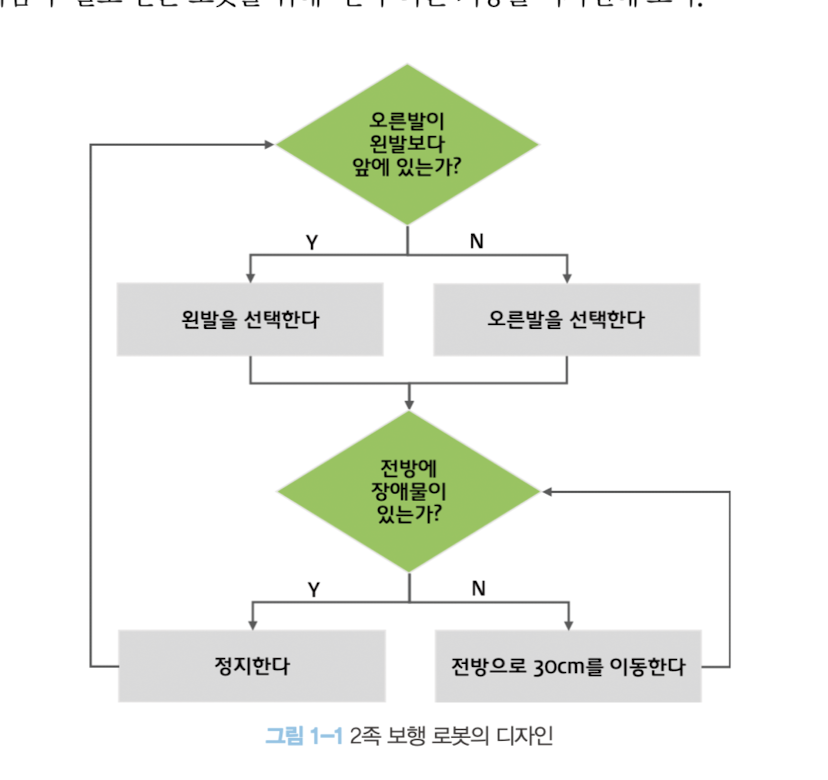

## 프로그래밍이란?

- 컴퓨터와 인간 사이의 일종의 커뮤니케이션
- 프로그래밍(커뮤니케이션)을 하기 앞서 어떤 문제를 해결해야하는지 요구사항을 명확히 이해한 후 문제 해결 방안을 정의할 필요가 있다.
- 이때 요구되는 것이 **문제 해결 능력** 이다.
  - 문제 해결 능력이 알고리즘만 말하는 것은 아님, 더 큰 차원의 영역, 프론트엔드 시스템 디자인도 들어갈 것 같다.
  - 복잡하고 명확하지 않은 문제(요구사항)를 이해하고 단순하게 분해 하고 자료를 정리해 구분하며 순서를 맞게 배열하는 것이 문제 해결 능력이다.
- 프로그래밍 : 정확하고 상세하게 요구사항을 설명하는 작업
- 컴퓨팅 사고 : 문제 해결 방안을 고려할 때 컴퓨터의 입장에서 문제를 바라봐야하는 것

**컴퓨팅 사고란?**

- 사람의 걷는다. - 다리를 앞뒤로 번갈아가며 걸어간다.
- 컴퓨터의 걷는다. - 
- "걷다"란 기능을 디자인하기 위해
  - 판단해야하는 상태
  - 상태를 판단하는 시기
  - 판단 기준을 정의
  - 분해한 process의 실행 여부
- 등을 명확히 수치화해서 정의해야한다.

## 프로그래밍 언어

- 정의된 문제 해결 방안은 컴퓨터가 수행하기 때문에 컴퓨터가 이해할 수 있는 기계어로 명령을 전달해야한다.
- 하지만 사람이 기계어로 직접 명령하기는 어렵다...문장 체계도 다르고 기계어는 심지어 비트 단위로 구성되어 있다.
- `Hello World' 출력 기계어
  - 
- 이런 코드를 사람이 직접 작성할 순 없기에 약속된 구분(syntax)와 의미(semantics)로 구성된 프로그래밍 언어(programing language)를 사용해 프로그램을 작성 후 번역기를 통해 컴퓨터가 이해할 수 있는 기계어로 번역한다. (마치 번역기를 통해 외국인과 대화를 나누는 과정 같다.)
- 이 번역기가 바로 컴파일러(compiler)와 인터프리터(interpreter)

## 구문과 의미

- 프로그래밍은 프로그래밍 언어를 공부하는 것으로 시작한다 (마치 외국어를 배우듯이)
- 하지만 문법을 잘 안다고 영어를 잘하는 것은 아니다. 문법에 맞는 문장을 구성하는 것은 당연하고 의미를 가지고 있어야 언어의 역할을 충실히 수행 가능하다.
- 노엄 촘스키 : `Colorless green ideas sleep furiously(무색의 초록빛 생각들이 맹렬히 잠을 잔다)` 무슨 의미지? 당연하다. 문법적으로 전혀 문제가 없지만 위 문장은 의미가 없다. 프로그래밍도 마찬가지다.
- `const number = "string"` `console.log(number * number);` 문법적으로 문제가 없으나 의미가 옳지 않다. number에는 숫자를 할당해야한다.
- 문제 해결 능력을 통해 만들어낸 해결 방안을 프로그래밍 언어의 문법을 사용해 표현하는 것
- 프로그래밍은 요구사항의 집합을 분석해서 적절한 자료구조와 함수의 집합으로 변환 후 흐름을 제어하는 것
