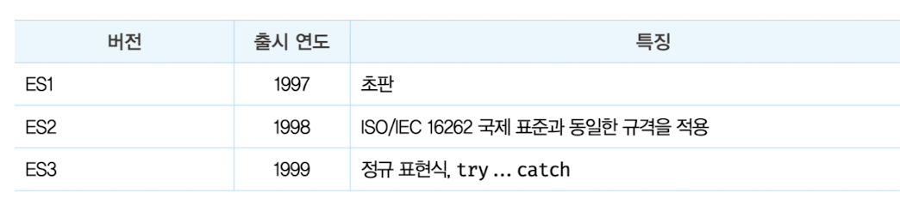
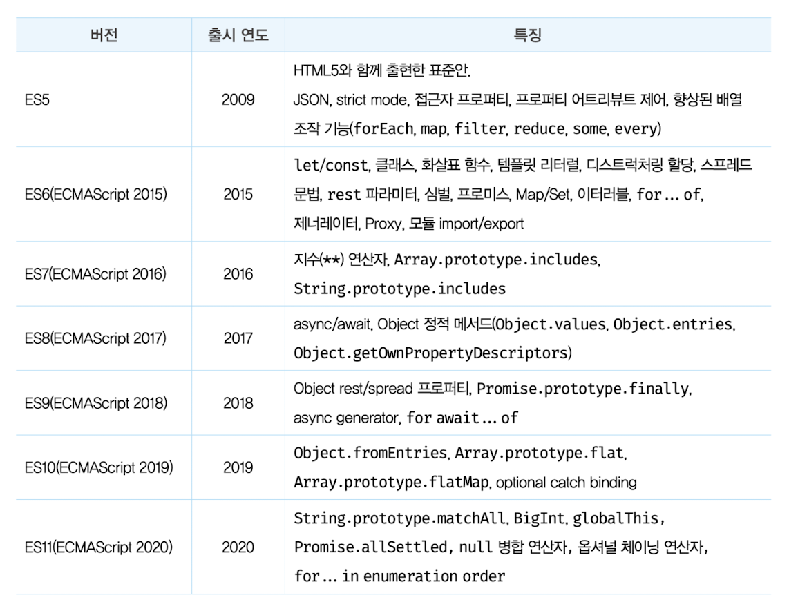
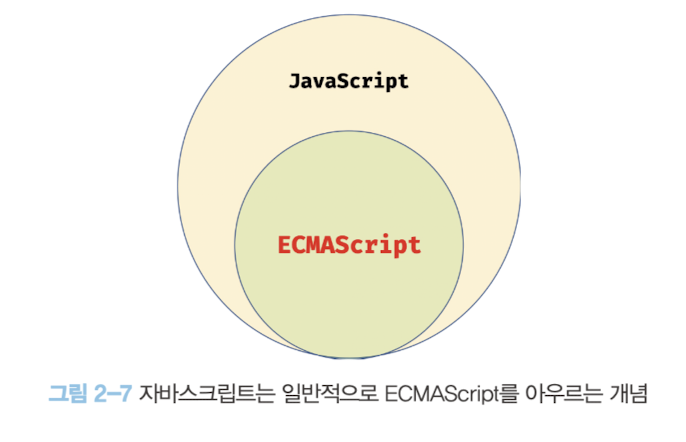

## 자바스크립트의 탄생

- `1995년` 웹 브라우저 시장을 90% 점유하고 있던 넷스케이프 커뮤니케이션즈에서 브렌던 아이크(Brendan Eich) 웹페이지의 **보조적인** 기능을 수행하기 위해 경량 프로그래밍 언저 자바스크립트를 개발했다.
- `1996년` 3월 넷스케이프 내비게이터(Netscape Navigator)2에 탑재 되어 모카(Mocha) -> 9월 라이브스크립트(LiveScript) -> 12월 자바스크립트(Javascript)로 바뀌었다.
  - but JScript의 등장으로 자바스크립트는 위기를 맞는다.
  

  
넷스케이프 커뮤니케이션즈

  

    기존에 모자이크라는 브라우저는 **마크 앤드리슨(Marc Andreessen)**과 에릭 비나(Eric Bina)가 공동 개발한 최초의 gui 브라우저다. 기존엔 모두 텍스트로 구현되어있었다. 반응은 폭팔적이나 개발 책임자 마크 앤드리슨이 동료를 데리고 1994년 넷스케이프 회사를 설립해 넷스케이프 내비게이터 웹브라우저를 개발해 모자이크는 개발이 중단되었다.. 모자이크는 1994년 스파이글래스(Spyglass)에 인수 -> 1995년 마이크로소프트가 인수해 소스코드를 활용해 인터넷 익스플로러 웹 브라우저를 개발했다.
  

  

## 자바스크립트의 표준화

- `1996년 8월` 8월 마이크로소프트가 JScript를 인터넷익스플로러 3.0에 탑재했다. 하지만 javascript와 완벽히 호환되지 않았다.
- 이에 넷스케이프 커뮤니케이션즈와 마이크로소프트는 자사 브라우저 점유율을 위해 자사 브라우저에서만 동작하는 기능을 경쟁적으로 넣기 시작했다.
- 따라서 크로스브라우징 이슈가 발생했다...이 때문에 모든 브라우저를 호환하는 웹페이지를 개발하기 어려워졌다.
- `1996년 11월` 모든 브라우저에서 정상적으로 동작하는 표준화가 필요했고 이를 위해 넷스케이프 커뮤니케이션즈가 컴퓨터 시스템의 표준을 관리하는 비영리 표준화 기구 ECMA 인터네셜에 javscript 표준화를 요청한다.
- `1997년 7월` ECMA-262(추후 상표권 문제로 ECMAScript 1으로 변경)라고 불리는 javascript 초판 사양이 완성됐다.
- `1999년` ECMAScript 3(ES3)이 공개되고 `2009년` ES5가 HTML5와 함께 출현해 표준사양이 되었다.
- `2015년`에 공개된 ES6는 let/const, 화살표함수, 클래스, 모듈과 같이 범용 프로그래밍 언어로써 가져야할 기능을 대거 도입했다.
  

### 자바스크립트 성장의 역사

- 초창기에는 웹페이지의 보조적인 기능 수행을 위해 사용, 이때는 웹 서버에서 실행되고 브라우저에는 서버가 전달한 HTML과 CSS를 단순 렌더링 하는 수준이였다.
  - `1999년` Ajax : 서버와 브라우저가 비동기 방식으로 데이터를 교환가능한 통신 기능 Ajax가 XMLHttpRequest라는 이름으로 등장했다.
    - 이전에는 완전한 html을 브라우저가 서버로 받아 웹페이지 전체를 다시 처음부터 렌더링하는 식으로 동작했다.(성능 저하, 통신 비용 과다)
    - Ajax는 변경해야하는 부분만 서버로부터 필요한 데이터를 받아 한정적으로 렌더링 해 빠른 성능과 부드러운 화면 전환을 한다.
    - 이를 통해 구글 맵스(Google Maps)는 부드러운 화면 효과를 증명했다.
  - `2006년`jQuery로 번거로운 DOM을 쉽게 제어하고 크로스 브라우징 이슈도 어느정도는 해결해 jQuery는 사용자 층을 순식간에 확보했다.
  - `2008년`구글맵스를 통해 자바스크립트가 프로그래밍 언어로 인정받자 JS로 웹애플리케이션을 구축하려는 시도가 생기며 빠르게 동작하는 자바스크립트를 위해 V8엔진이 등장했다.
    - 이에 웹서버에서만 돌아가던 로직이 대거 브라우저로 이동했고 웹 애플리케이션 개발에서 프론트엔드 영역이 주목받는 계기로 작용했다.
  - `2009년` 라이언 달(Ryan Dahi)이 발표한 Node.js는 구글 V8엔진으로 빌드된 자바스크립트 런타임 환경이다.
    - 브라우저 환경에서 독립되어 실행할 수 있게 한 자바스크립트 실행 환경이다. 주로 서버사이드어플리케이션 개발에 사용된다.
    - 모듈, 파일 시스템, HTTP등 빌트인(내장) API를 제공한다.
    - 프론트/백 둘다 JS를 사용가능하게 해준다.
    - 비동기 I/O를 지원하며 단일 스레드 이벤트 루프 기반으로 동작해 요청 처리 성능이 좋다.
    - 크로스 플랫폼 지원(모바일하이브리드앱, 서버사이드, 데스크톱, 머신러닝, 로보틱스)
    

    
Node.js 성능

    

    

    

  - 개발 규모와 복잡도 증가로 많은 라이브러리가 생겼지만 상태를 어디 저장할지, 파일을 어떻게 나눌지 등등 아키텍쳐를 잡아주지 않아 CBD(Component based development)방법론을 기반으로 하는 SPA가 대중화되었다.

### 자바스크립트와 ECMAScript

- ECMAScript : 변수, 함수, 클래스, Object/Array/Promise/Math 같은 빌트인 객체로 ECMA-262 표준에서 정한다.
- Web API : DOM, BOM, Canvas, XMLHttpRequest, fetch, requestAnimationFrame, SVG, WebStorage, Web Component, Web Worker 등을 아우르는 개념으로 W3C(월드 와이드 웹 콘소시엄)에서 별도 사양으로 관리 중이다.
  

### 자바스크립트 특징

- 웹 브라우저에서 동작하는 유일한 언어, 별도의 컴파일을 수행하지 않는 인터프리터 언어
- 대부분의 모던 자바스크립트 엔진은 컴파일러 + 인터프리터로 속도가 느린 인터프리터의 단점을 해결했다.
- 자바스크립트는 명령형, 함수형, 프로토타입 기반 객체지향 프로그래밍을 지원하는 멀티 패러다임 프로그래밍언어이다.

### ES6 브라우저 지원 현황

- 대부분의 모던 브라우저는 ES6를 지원하지만 100% 지원하고 있지는 않다.
- 따라서 브라우저에서 아직 지원하지 않는 최신 기능이나 구형 브라우저를 고려해야한다면 바벨(Babel)같은 트랜스파일러를 통해 ES5 이하의 사양으로 다운그레이드 할 필요가 있다.
