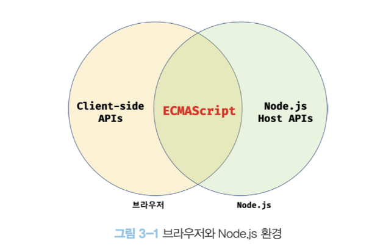

### 자바스크립트 실행 환경

- 브라우저와 Node.js는 주된 목적이 다르기 때문에 ECMAScript이외 추차 제공되는 기능은 호환되지 않는다.
- ex) 브라우저는 HTML 요소를 관리하는 DOM API를 제공하나 Node.js는 제공하지 않음
- ex) Node.js는 파일을 생성하고 수정하는 파일 시스템을 제공하지만 브라우저는 제공하지 않음, 보안상의 이유
  

### 웹 브라우저

- 크롬은 ECMAScript 사양을 준수하고 시장 점유율도 높다.
  - 2021년 1월 크롬 점유율 65.47%, 사파리 16.97%
    - 여담 : 현재 2026년 8월 크롬 69.28%, 사파리 15.92%
- 개발자 도구의 기능
  - Elements: DOM과 CSS편집해 렌더링된 뷰를 확인할 수 있다.
  - Console : 웹페이지 에러나 소스코드 내 console.log를 확인한다.
  - Sources : 자바스크립트 코드를 디버깅 할 수 있다.(다들 사용하는지?)
  - Network : 네트워크 요청(request) 정보와 성능을 확인할 수 있다.
  - Application : 웹 스토리지, 세션, 쿠키를 확인 및 관리할 수 있다.
  - 기타 : Lighthouse, Performance, Coverage..
- 콘솔
  - 에러가 발생할때 살펴보거나 console.log 메서드를 활용해 코드 실행 결과를 확인할 때 쓴다.
  - 콘솔창 내에서 바로 코드를 입력해 결과확인이 가능한 REPL(Read Eval Print Loop : 입력 수행 출력 반복)환경으로 사용 가능하다.

### Node.js

- 간단한 웹 애플리케이션은 브라우저만으로 가능하나 규모가 커지고 React, Angular, Lodash 같은 프레임워크 or 라이브러리를 도입하거나 Babel, Webpack, ESLint등 여러 도구를 사용할 필요가 있다. 이때 Node.js와 npm이 필요하다.
  - `2009년` 라이언탈이 발표한 Node.js는 크롬 V8엔진으로 빌드된 자바스크립트 런타임 환경이다.
  - npm(node package manager)는 자바스크립트 패키지 매니저로 Node.js에서 사용할 수 있는 모듈들을 패키지화해 모아둔 저장소 역할과 패키지 설치 및 관리를 위한 CLI를 제공한다.
- Node.js REPL
  - REPL(Read Eval Print Loop)를 사용하면 간단한 자바스크립트 코드를 실행해 결과를 확인할 수 있다.
  - `node`
- Code Runner
  - 소스코드를 간단히 실행해볼 수 있는 플러그인,
  - 윈도우 Ctrl + Alt + N, macOS : control + option + N
  - Code Runner로 Web API를 실행하면 참조 에러가 발생한다.
  - Code Runner는 Node.js 환경을 사용해 자바스크립트를 실행하기 때문
- Live Server 확장 플러그인
  - Web API를 실행하려면 개발자도구의 콘솔이나 자바스크립트 코드를 HTML에 삽입 후 브라우저에서 열어야한다.
  - Live Server는 소스코드 수정 시 라이브 리로드가 동작해 편리하다.
