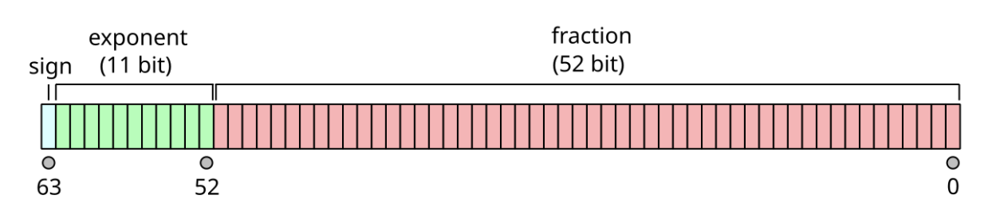
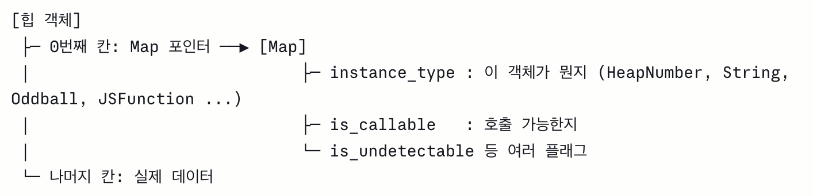
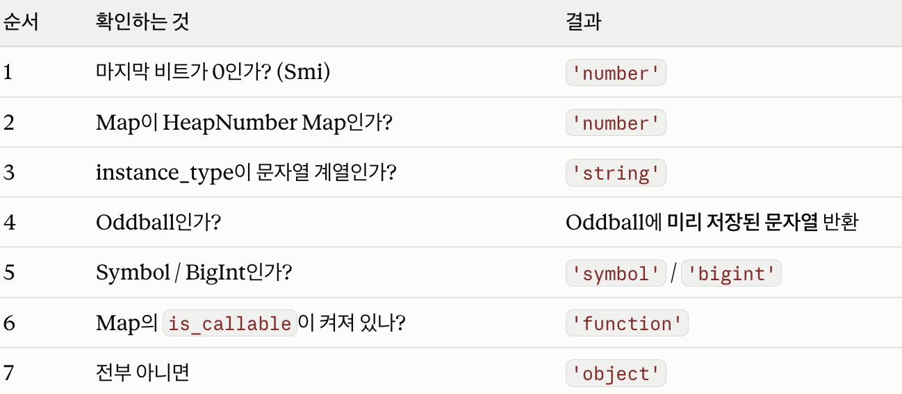
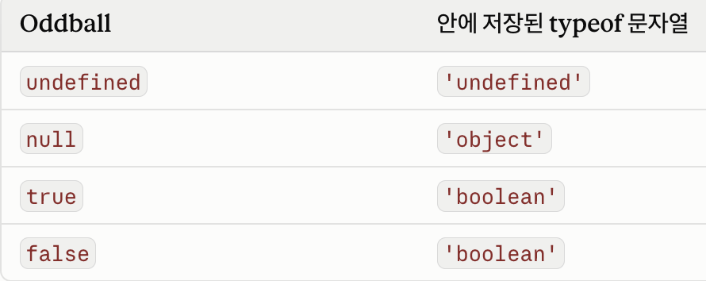

## 데이터 타입이란

- 데이터 타입은 값의 종류이다.
- 같은 2진수의 값이여도 데이터 타입에 따라 값이 달라진다.

## 데이터 타입이 필요한 이유

- 값을 메모리에 저장하려면 먼저 확보해야할 메모리 공간의 크기를 결정해야하는데
  - 자바스크립트 엔진은 값의 데이터 타입에 따라 확보해야 할 메모리 공간 크기를 결정한다.
- 값을 참조하려면 자바스크립트 엔진은 값이 저장된 메모리 공간의 선두에 메모리주소에 접근해 값을 읽는다.
  - 이때 값을 참조하기 위해 한번에 저장된 메모리셸의 개수를 알아내려면 데이터 타입을 통해 해당 값이 차지하고 있는 메모리 셸의 크기를 파악해 값을 읽어들인다.
- 값을 해석할 때 읽어들인 2진수를 어떤 값으로 해석할지 결정한다.

## 숫자타입

- 숫자타입은 ECMAScript 사양에 따르면 모든 수를 실수로 처리하는 배정밀도 64비트 부동소수점 형식을 따른다.
- 정수, 실수, 2진수, 8진수, 16진수 리터럴 모두 이 형식의 2진수로 저장된다.
- 부동 소수점이란 소수점이 이동하는 것으로 1비트는 부호를, 11비트는 지수를, 나머지 52비트는 가수를 뜻한다.
  
- 정수, 실수, 2진수, 8진수, 16진수 리터럴은 모두 메모리에 배정밀도 64비트 부동소수점 형식의 2진수로 저장된다.
- 하지만 자바스크립트는 2진수, 8진수 16진수를 표현하는 데이터 타입을 지원하지 않기 때문에 이를 값을 참조하면 10진수로 표현된다.
  ```javascript
  0b01000001; // 65
  0o101; // 65
  0x41; // 65
  ```
- 0.1 + 0.2 !== 0.3 인 이유
  - 소수점은 2진수로 데이터를 저장하려고 하면 정확히 떨어지지 않는다(0.000110011001100110....)
  - 하지만 가수부는 52비트로 제한되어 있어, 넘치는 부분을 반올림해서 잘라 저장한다.
  - 이 과정에서 미세한 오차가 생긴다.
    ```javascript
    0.1 + 0.2; // 0.30000000000000004
    0.1 + 0.2 === 0.3; // false
    ```
  - 따라서 숫자 타입이 가질 수 있는 최대는 64비트로 총 메모리 셸(8비트) 8개를 가질 수 있기 때문에 길어진 2진수의 뒤를 잘라서 저장한다.
  - 이 과정에 미세한 오차가 발생한다. 따라서 0.1 + 0.2 = 0.3이 되지 않는 것이다.

## 문자열 타입

- 문자열은 0개 이상의 16비트 유니코드 문자(UTF-16)으로 이루어진 문자의 집합이다.
  - 문자열은 '', "", 백틱로 감싸 사용한다.
- 템플릿 리터럴은 ES6에 도입된 새로운 문자열 표기법으로 다양한 문자열 처리 방법을 제공한다.
  - 멀티라인 문자열: 일반 문자열은 줄바꿈이 허용되지 않아 \n 같은 이스케이프 시퀀스를 써야 하지만, 템플릿 리터럴은 줄바꿈과 공백이 그대로 반영된다.
  - 표현식 삽입: ${}로 표현식을 간단히 넣을 수 있다. 반드시 템플릿 리터럴 안에서만 사용 가능하다.

## 불리언 타입

- false, true

## undefined vs null

- undefined는 개발자가 의도적으로 할당하는 값이 아니라 자바스크립트 엔진이 변수를 초기화할때 사용한다.
  - 개발자가 의도적으로 undefined를 사용하면 원래 취지와 다르기 때문에 권장하지 않는다.
- 따라서 값이 없다를 표현하고 싶다면 Null을 사용한다.
  - 자바스크립트는 대소문자를 구별하므로 소문자 null로만 사용해야한다.
  - null은 개발자가 해당 변수에 이전의 참조하던 값을 지우고 어떠한 값도 넣지 않겠다는 것을 뜻한다.
  - 함수가 유효한 값을 반환할 수 없을 경우 null을 반환하기도 한다.

## 객체 타입

- 원시 타입을 제외한 모든 타입은 객체 타입이다.
  - 객체타입은 6가지의 원시 타입(숫자, 불리언, 문자열, 심벌, undefined, null)을 제외한 모든 타입을 객체타입이라고 한다.
  - 자바스크립트는 객체기반의 언어이며 자바스크립트를 이루고 있는 거의 모든 것들은 객체이다.

## 정적 타입

- 다른 언어는 명시적 타입 선언을 통해 변수에 할당 할 수 있는 데이터 타입을 미리 정의해야한다.
  - 또 컴파일 단계에서 변수 타입에 맞는 값이 들어가 있는지 타입 체크를 한다.
  - 이를 통해 런타임에 발생할 에러를 줄인다.
- 하지만 자바스크립트는 변수에 타입을 지정하지 않고 키워드(var, let, const)로 변수를 선언한다.
  - typeof로 변수 타입을 체크하면 변수가 가지고 있는 값의 타입을 체크한다.
  - 이 말은 변수의 타입은 변수에 할당된 값의 타입을 따라간다.
  - 이를 타입 추론이라고 하고 언제든지 값의 재할당에 따라 변수의 타입이 바뀌는 것을 동적 타이핑이라고 한다.
- **변수는 값에 묶인 별명이기 때문에 변수가 타입을 가진다기 보다는 변수는 할당된 값의 타입을 따라간다.**
  - 하지만 값의 변경에 따라 변수가 따라가는 타입이 변하기에 개발자의 의도와 상관 없이 암묵적으로 타입이 변경된다.
  - 따라서 의도하지 않는 타입으로 인해 오류가 발생한다.

<details>
<summary>V8엔진에서의 typeof 동작원리</summary>

- V8에서 변수 칸에 들어가는 것은 Smi, 힙포인터 두가지다.
- 마지막 비트 하나로 구분한다.

```javascript
...0 1 0 1 0 | 0   ← 마지막 비트 0: Smi (앞의 비트들이 정수 값 그 자체)
...주소 비트 | 1   ← 마지막 비트 1: 힙 포인터 (1을 빼면 실제 힙 주소)
```

- Smi : 칸 안에 값이 직접 들어있으므로 작은 정수이다.
- 힙 포인터 : 칸 안에 주소가 들어있으므로 힙까지 따라가서 확인해야 한다. - 힙에 있는 모든 객체는 첫번째 칸에 Map을 가리키는 포인터가 있다. -  - Map은 이 객체가 어떤 종류인지 적혀있다. - 같은 종류 객체들은 같은 Map을 공유한다. (모든 HeapNumber는 같은 HeapNumber Map을 가리킴)
 - Oddball - undefined, null, true, false는 앞에서 본 힙의 싱글톤이고, V8은 이걸 Oddball이라는 종류로 묶어둔다. - 각 Oddball 객체 안에는 자기가 typeof로 뭘 반환해야 하는지가 문자열로 저장되어 있다.
 - 엔진은 그 안에 적힌 문자열을 그대로 꺼내 반환한다. - `typeof null === 'object'` 버그의 이유 - is_callable - Map의 is_callable 플래그가 켜져있는 것으로 함수인지 바로 판별한다.
</details>

## 변수 사용 시 주의사항

1. 변수는 꼭 필요한 경우에만 사용하자, 많은 변수 선언은 많은 오류 발생률을 높인다.
2. 변수의 유효범위(스코프)를 최대한 좁게 해 부작용을 억제하자.
3. 전역 변수는 최대한 자제하자, 어디서든 참조/재할당이 가능한 전역변수는 타입을 추적하기 힘들다.
4. 재선언/재할당이 안되는 상수 값을 활용하자
5. 식별자를 변수의 의미를 알 수 있도록 짓자.
