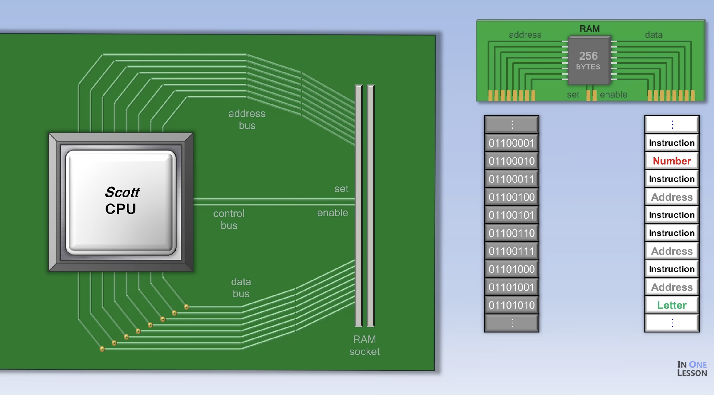
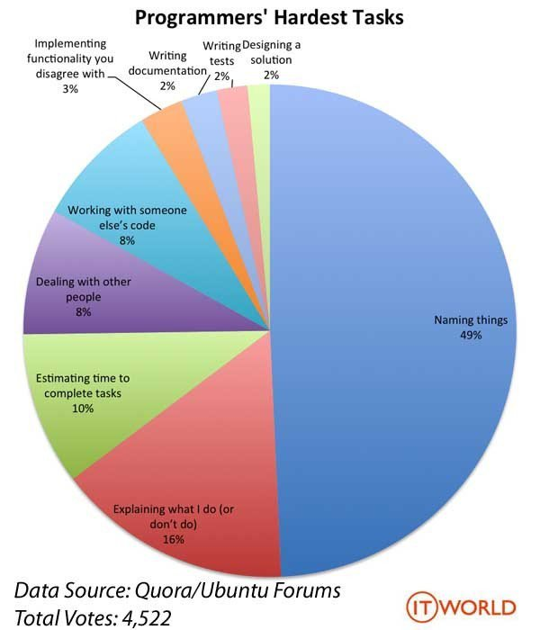

# 4장. 변수

- 복잡한 애플리케이션도 결국 **데이터를 입력받아 처리하고 결과를 출력**하는 게 전부
- 컴퓨터는 CPU를 사용해 연산하고, 메모리를 사용해 데이터를 기억

## CPU 작동 원리


  
[How a CPU Works](https://www.youtube.com/watch?v=cNN_tTXABUA)

- CPU는 **제어장치**(명령 해석), **ALU**(산술논리연산장치), **레지스터**(임시 저장공간)로 구성
- 프로그램(명령어)과 데이터는 **메모리**(RAM)에 저장되어 있고, CPU는 **주소**로 메모리에 접근
- CPU는 아래 과정을 반복
  1. 메모리에서 명령어를 가져오고 (Fetch)
  2. 무슨 명령인지 해석하고 (Decode)
  3. 계산한 뒤 결과를 저장 (Execute)
- 그런데 메모리 주소를 직접 쓰는 건 어려움
  - 주소는 실행할 때마다 바뀔 수 있고, 자바스크립트는 메모리를 직접 건드릴 수 없음
- 그래서 **변수** = 메모리 공간에 **이름을 붙여서** 사람이 쉽게 데이터를 다룰 수 있게 해주는 것
  - 이 변수 이름을 **식별자**라고 부름

## 좋은 변수명 짓기

- 코드의 가독성을 높이고 유지보수를 쉽게 하기 위해서 변수명을 잘 지어야 함
- 코드의 맥락을 모르는 사람이 처음 코드를 봐도 이해하기 쉽게, 3개월 후에 봐도 이해하기 쉽게
- 주석 설명이 필요한 변수는 존재 목적을 드러내지 못하는 것으로 NG!
- 좋은 이름 = 주석과 추가 설명 없이도 뭔지 알 수 있는 이름



- 의도를 명확하게 드러내기
- 단수/복수 구분하기 (`user` / `users`)
- 불필요하게 축약하지 않기 (`usrNm` X → `userName` O)

## 변수 선언

- `var`는 선언과 초기화가 **한 번에** 진행됨 (`let`, `const`는 따로 진행 → 호이스팅에서 차이 발생)
  - **선언 단계**: 변수 이름을 등록해 엔진에 변수의 존재를 알림
  - **초기화 단계**: 값을 저장할 메모리 공간을 확보하고 `undefined`를 암묵적으로 할당
- 선언하지 않은 식별자 참조 → `ReferenceError`

## 변수 호이스팅

- 엔진은 코드를 한 줄씩 실행하기 **전에** 소스코드 평가 과정에서 선언문을 먼저 처리함
- 그래서 선언문이 **스코프의 선두로** 끌어올려진 것처럼 동작 → **호이스팅**
- 모든 선언문(`var`, `let`, `const`, `function`, `class` 등)은 호이스팅됨
- 단, 선언 전에 참조했을 때의 결과는 다름
  - `var` → `undefined` (선언 + 초기화가 미리 끝나 있음)
  - `let`, `const` → `ReferenceError` (선언만 되고 초기화 전이라 못 씀, 이 구간을 **TDZ**라고 부름)

## 값의 할당

```js
console.log(score); // undefined

var score = 80;

console.log(score); // 80
```

- **선언은 런타임 이전**, **할당은 런타임**에 실행
- `var score = 80;`처럼 한 문장으로 써도 내부적으로는 나눠서 실행
  - 런타임 이전: 선언 + `undefined`로 초기화
  - 런타임: `80` 할당

## 재할당

- 원시값(숫자, 문자열 같은 기본 값)은 **불변**이라서, 재할당하면 기존 공간을 덮어쓰지 않고 **새 메모리 공간에 값을 저장**한 뒤 식별자가 새 주소를 가리킴
  - ※ 책이 설명하는 개념 모델. 실제 엔진(V8 등)은 최적화에 따라 다르게 구현될 수 있음
- 아무도 참조하지 않는 이전 값은 **가비지 콜렉터**가 해제 (정확한 시점은 알 수 없음)
- 재할당할 수 없는 변수 = **상수** → `const`로 선언

## 식별자 네이밍

### 규칙 (지키지 않으면 에러)
- 문자, 숫자, `_`, `$` 사용 가능 (유니코드라서 한글도 가능하지만 권장하지 않음)
- 숫자로 시작 불가
- 예약어(`var`, `function`, `if` 등) 사용 불가
- 대소문자 구분 → `myName`과 `myname`은 별개의 변수

### 관례
- 변수·함수: **camelCase** (`userName`)
- 생성자·클래스: **PascalCase** (`UserProfile`)
- 상수: **UPPER_SNAKE_CASE** (`MAX_COUNT`)