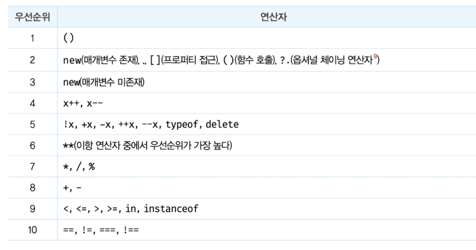
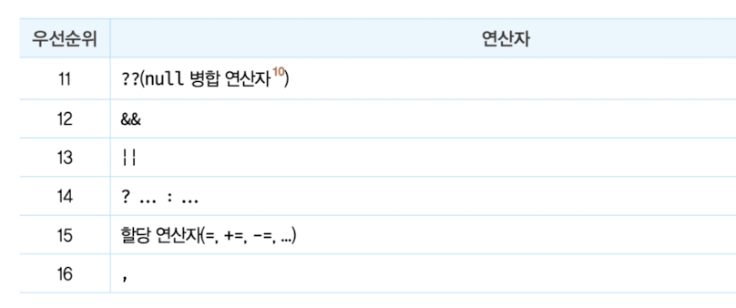
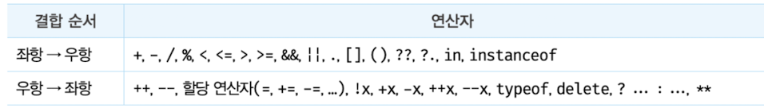

# 연산자

피연산자가 '값'이라는 명사의 역할을 한다면, 연산자는 '피연산자를 연산하여 새로운 값을 만든다'라는 동사의 역할을 한다.

- 피연산자는 값으로 평가될 수 있어야 한다.
- 연산자는 값으로 평가된 피연산자를 연산해 새로운 값을 만든다.

## 산술 연산자

피연산자를 대상으로 수학적 계산을 수행해 새로운 숫자 값을 만든다.

### 이항 산술 연산자

- 2개의 피연산자를 산술 연산한다. (`1 + 1`)
- 피연산자의 값을 바꾸는 부수 효과가 없고, 항상 새로운 값을 만든다.

### 단항 산술 연산자

- 1개의 피연산자를 산술 연산한다.
- 증가/감소(`++`/`--`) 연산자는 피연산자의 값을 변경하는 부수 효과가 있다.
  - 전위(`++a`): 먼저 피연산자의 값을 증가/감소시킨 후 다른 연산을 수행한다.
  - 후위(`a--`): 먼저 다른 연산을 수행한 후 피연산자의 값을 증가/감소시킨다.
- `+` 단항 연산자는 숫자 피연산자에 대해 아무 효과가 없다.
  - 숫자 타입이 아닌 피연산자에 사용하면 숫자 타입으로 변환한 값을 반환한다.
  - 피연산자 자체를 변경하는 것이 아니라, 변환된 새 값을 생성해 반환한다.
- `-` 단항 연산자는 피연산자의 부호를 반전한 값을 반환한다.
  - 역시 피연산자 자체를 바꾸지 않고, 부호가 반전된 새 값을 생성해 반환한다.
  - 숫자 타입이 아닌 피연산자에 사용하면 숫자 타입으로 변환해 반환한다.

### 문자열 연결 연산자

- `+` 연산자는 피연산자 중 하나 이상이 문자열이면 문자열 연결 연산자로 동작한다.
- 암묵적 타입 변환(implicit coercion) 또는 타입 강제 변환(type coercion)
  - `'1' + 2 // '12'` 처럼 개발자의 의도와 상관없이 자바스크립트 엔진이 암묵적으로 타입을 변환한다.

## 할당 연산자

- 우항 피연산자의 평가 결과를 좌항 변수에 할당한다.
- 변수 값이 바뀌므로 부수 효과가 있다. (`x += 5`)
- 할당문은 표현식인 문이며, 할당된 값으로 평가된다. 따라서 할당문을 다른 변수에 할당할 수 있다.
  - 연쇄 할당: `a = b = c = 0;` (오른쪽부터 평가)

## 비교 연산자

- 동등 비교(`==`)와 일치 비교(`===`)가 있다.
  - 동등 비교: 암묵적 타입 변환으로 타입을 일치시킨 후 값을 비교한다. (`5 == '5' // true`)
  - 일치 비교: 타입과 값이 모두 같을 때만 `true`를 반환한다. (`5 === '5' // false`)
- `NaN`은 자신과 일치하지 않는 유일한 값이다. (`NaN === NaN // false`)
  - 따라서 `NaN` 여부는 `Number.isNaN`으로 확인한다.
- 동등/일치 비교 모두 결과가 헷갈리기 쉬우므로 일치 비교(`===`) 사용을 권장한다.

### Object.is와 일치 비교(===)의 차이

- `Object.is`는 ES6에서 도입된 메서드로, 대부분 `===`와 같지만 두 가지 경우에 다르게 동작한다.

```javascript
  NaN === NaN;          // false
  Object.is(NaN, NaN);  // true

  +0 === -0;            // true
  Object.is(+0, -0);    // false
```

- 즉 `Object.is`는 `===`보다 "같은 값인가"를 더 정확하게 판단한다. (SameValue 알고리즘)
- `===`에서의 비교
  - IEEE 754 부동소수점 표준의 비교 규칙 사용
  - NaN은 "계산 실패"라서 어떤 값과도 같다고 보지 않음 (자기 자신 포함)
  - +0과 -0은 부호 비트만 다른 0이므로 false
- `Object.is`에서 의 비교
  - "수학적으로 같나"가 아니라 "완전히 같은 값인가"를 본다.
  - NaN끼리 비교 시 같은 Not a Number 값이기에 true
  - +0, -0은 +infinity, -infinity로 값이 다르기에 false

```javascript
  Object.is({}, {});    // false
  const obj = {};
  Object.is(obj, obj);  // true
```

### React에서 Object.is를 사용하는 이유

- React는 state 변경 여부, `useEffect`/`useMemo`/`useCallback`의 의존성 배열, `React.memo`의 props 비교에 `Object.is`를 사용한다.
- `setState`로 넘긴 값이 이전 값과 `Object.is` 기준으로 같으면 리렌더링을 건너뛴다.
- 만약 `===`로 비교했다면 state가 `NaN`일 때 `NaN !== NaN`이므로, 같은 `NaN`을 set할 때마다 불필요한 리렌더링이 발생한다.

## typeof 연산자

- 피연산자의 데이터 타입을 문자열로 반환한다.
- `typeof null`은 `'null'`이 아니라 `'object'`를 반환한다. (자바스크립트 초기 버그)
  - `null` 확인은 `=== null`로 한다.
- 선언하지 않은 식별자에 `typeof`를 사용하면 ReferenceError가 아니라 `'undefined'`를 반환한다.

## 부수 효과가 있는 연산자

부수 효과가 있으면 다른 코드에 영향을 준다.

- 할당 연산자(`=`, `+=` 등): 변수 값이 변해 해당 변수를 사용하는 코드에 영향을 준다.
- 증가/감소 연산자(`++`/`--`): 피연산자 변수의 값을 변경해 해당 변수를 사용하는 코드에 영향을 준다.
- `delete` 연산자: 객체의 프로퍼티를 삭제해 해당 객체를 사용하는 코드에 영향을 준다.

## 연산자 우선순위

- 
- 
- 연산자 종류가 많아 우선순위를 모두 외우기보다는, 그룹 연산자 `()`로 우선순위를 명시적으로 조절하자.

## 연산자 결합 순서

- 결합 순서: 연산자의 어느 쪽(좌항/우항)부터 평가를 수행하는지를 말한다.
- 